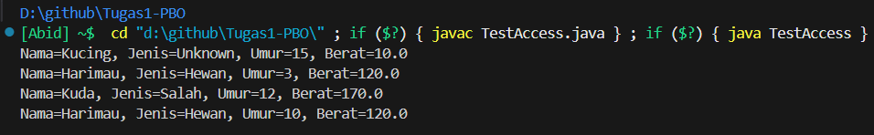
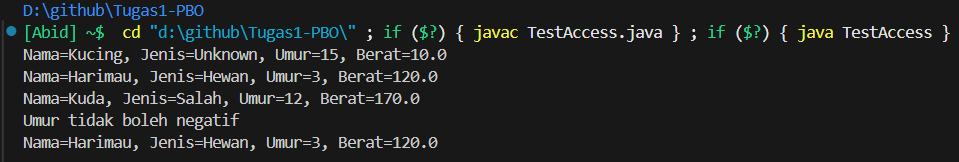

 ```
Nama    : Muhamad 'Abid Fakhri Nabiil
NIM     : 32602400022
```

# 📘 Tugas 1 Pemrograman Berorientasi Object
### Meliputi materi :
1. **Class dan Object (Pertemuan 2)**
2. **Encapsulation (Pertemuan 3)**
3. **Constructor (Pertemuan 4)**


---

## 💻 Analisa Kode Berikut

### Kode `MakhlukHidup.java` dan `TestAccess.java` versi `ERROR`
><div style="color: blue">
><strong>Tugas:<br/>
>1. Temukan, jelaskan, dan perbaiki setiap error berkaitan dengan materi pada MakhlukHidup.java dan TestAccess.java. Ada 10+ kesalahan. Setiap kesalahan memiliki skor (lihat pada tabel skor). Skor minimal LULUS = 60.
><br/>
>2. Tuliskan output dari TestAccess jika kode sudah diperbaiki
></strong>
</div>

```java

public class MakhlukHidup {

    private string nama;       
    private String jenis;
    public double berat = -1.0;  
    private int umur;


    public MakhlukHidup() {
        this.nama = "Unknown";
        this.jenis = "Unknown";
        this.umur = 15;
        this.berat = 10.0;
    }

    public void MakhlukHidup(String nama) { 
        this.nama = nama;
        this.jenis = "Salah";
        this.umur = 12;
        this.berat = 170.0;
    }

    public makhlukHidup(String nama, String jenis, int umur, double berat) { 
        this.nama = jenis;  
        this.jenis = nama; 
        this.umur = umur;
        this.berat = berat;
    }

    public MakhlukHidup(MakhlukHidup other) {
        this.nama = nama; 
        this.jenis = other.jenis; 
        this.umur = this.umur; 
        this.berat = other.berat;
    }


    public void setUmur(String umur) { 
        this.umur = umur;
    }

    public void setNama(String nama) {
        nama = this.nama; 
    }

    public int getInfo() { 
        return "Nama=" + nama + ", Jenis=" + jenis 
        + ", Umur=" + umur + ", Berat=" + berat;
    }
}

```

```java
class TestAccess {
    public static void main(String[] args) {
        MakhlukHidup m = new MakhlukHidup();
        
        m.nama = "Kucing";  
        
        MakhlukHidup m2 = new MakhlukHidup("Harimau", "Hewan", 3, 120.0);
        
        MakhlukHidup m3 = new MakhlukHidup(m2);
 
        System.out.println(m.getInfo());
        
        System.out.println(m2.getInfo());
        
        m2.MakhlukHidup("Kuda"); 
                
        System.out.println(m2.getInfo());
        
        m3.setUmur(-10); 
        
        System.out.println(m3.getInfo());

        
    }
}
```


## Table Score
| No | Error | Materi terkait            | Skor |
|----|-------|---------------------------|------|
| 1  | ERR1  | Class & Object (syntax)   | 10   |
| 2  | ERR2  | Class & Object (type)     | 10   |
| 3  | ERR3  | Constructor/init          | 10   |
| 4  | ERR4  | Encapsulation / Setter    | 10   |
| 5  | ERR5  | Constructor (copy)        | 10   |
| 6  | ERR6  | Constructor (copy)        | 10   |
| 7  | ERR7  | Encapsulation / Setter    | 10   |
| 8  | ERR8  | Class & Object (type)     | 10   |
| 9  | ERR9  | Class & Object (type)     | 10   |
| 10 | ERR10 | Encapsulation / Validation| 10   |
**Total skor : 100**

## Petunjuk Pengerjaan

Temukan semua ERR#, jelaskan kenapa salah dalam bentuk table dengan kolom berikut, selanjutnya tulis kode perbaikannya.

| No | Class        | Kesalahan | Perbaikan |
|----|--------------|-----------|-----------|
| 1 | MakhlukHidup | [contoh] variable `jumlah` salah penulisan akses `publik` | seharusnya `public jumlah = 10`|

2. Kompilasi dan jalankan setelah diperbaiki.
3. Upload kode pada **Github** repository anda dan **upload link nya ke dalam sinau** di topik **Tugas 1 PBO** disertai **file penjelasannya** dalam format word atau markdown

> Peringatan : Penggunaan AI tidak menjamin jawaban anda semuanya benar

---

## 📝 PENYELESAIAN

Berikut daftar error yang ditemukan

| No |    Class   |Kesalahan|Perbaikan|
|----|------------|---------|---------|
| 1  |MakhlukHidup|Tipedata `string` pada variabel `nama` salah penulisan syntax.| Seharusnya `String` huruf S-nya harus kapital.|
| 2  |MakhlukHidup|Salah penulisan nama constructor `makhlukHidup` tidak sama dengan nama class.| Seharusnya `MakhlukHidup` sesuai dengan nama classnya yaitu menggunakan M kapital.|
| 3  |MakhlukHidup|Memasukkan nilai variabel `nama` dengan nilai `jenis` pada parameter.|Seharusnya `nama` dengan `nama` yaitu `this.nama = nama`.|
| 4  |MakhlukHidup|Memasukkan nilai `jenis` dengan nilai `nama` pada parameter.|Seharusnya `jenis` dengan `jenis` yaitu `this.jenis = jenis`.|
| 5  |MakhlukHidup|Salah penulisan `nama`, sehingga nilai nama dari objek `other` tidak tercopy.|Seharusnya `other.nama`, sehingga nama dari `other` akan tercopy.|
| 6  |MakhlukHidup|Salah penulisan `this.umur`, sehingga nilai umur dari objek `other` tidak tercopy.|Seharusnya `other.umur`, sehingga umur dari `other` akan tercopy.|
| 7  |MakhlukHidup|Salah tipedata pada parameter `setUmur()` yaitu `String umur`.|Seharusnya `int umur` karena tipedata variabel `umur` adalah `int`.|
| 8  |MakhlukHidup|Salah penulisan `nama = this.nama` pada method `setNama()`.|Seharusnya `this.nama = nama`, variabel nama diisi dengan nama yang telah dimasukkan di parameter.|
| 9  |MakhlukHidup|Kesalahan tipedata pada method `getInfo()` di situ tertera tipedata `int`.|Seharusnya adalah `String` karena nilai return berupa kalimat bukan angka.|
| 10  |MakhlukHidup|Terdapat method dengan nama yang sama dengan constructor yaitu pada `public void MakhlukHidup`. Ini bukan constructor karena terdapat tipedatanya yaitu `void`.|Meski tidak menyebabkan error, lebih baik dihindari. Perbaiki dengan mengganti namanya dengan nama yang berbeda misal `public void Makhluk`.|
| 11  |MakhlukHidup|Di **Setter**, `setUmur()` tidak ada validasi.|Menambahkan validasi misal diberikan filter agar nilai tidak negatif, misal `if(umur < 0){ return; }` jika umur negatif maka nilai tidak akan dimasukkan.|
| 12 |MakhlukHidup|Pada atribut `berat` diberikan nilai.|Tidak perlu diberi nilai, meski tidak error, nilai yang telah diberikan -1.0 akan tertimpa dengan nilai dari constructor yaitu 10.0, jadi nilai terakhir yang akan ditampilkan.|
| 13 |TestAccess|Memberi nilai langsung ke nama `m.nama = "Kucing"`.|Karena atribut nama **private** maka harus memakai `setNama()` (**Setter**) untuk mengisi namanya `m.setNama("Kucing")`.|
| 14 |TestAccess|Nama method tidak sama dengan yang ada di class `MakhlukHidup` yaitu `Makhluk()` pada `m2.MakhlukHidup("Kuda")`.| Ganti dengan `m2.Makhluk("Kuda")` seperti yang telah diubah sebelumya.|
| 15 |TestAccess| Mengisi umur dengan nilai negatif `-10`| Karena telah diberikan validasi di **Setter** pada class `MakhlukHidup` maka isikan dengan nilai positif misal `10`.|

### 🛠️ Berikut Kode yang telah Diperbaiki
> MakhlukHidup.java
```java

public class MakhlukHidup {

    private String nama; // Salah syntax sudah diperbaiki     
    private String jenis;
    public double berat; // Nilai yang diberikan di berat dihilangkan karena sudah ada di constructor
    private int umur;

    // Constructor
    public MakhlukHidup() {
        this.nama = "Unknown";
        this.jenis = "Unknown";
        this.umur = 15;
        this.berat = 10.0;
    }

    // Bukan constructor karena ada void dihindari nama method sama dengan nama class
    public void Makhluk(String nama) { 
        this.nama = nama;
        this.jenis = "Salah";
        this.umur = 12;
        this.berat = 170.0;
    }

    // Parameterized Constructor
    public MakhlukHidup(String nama, String jenis, int umur, double berat) { // Salah penulisan nama class harusnya MakhlukHidup M nya besar
        this.nama = nama; // Sudah diperbaiki yang asalnya this.nama = jenis;
        this.jenis = jenis; // Salah penulisan harusnya this.jenis = nama;
        this.umur = umur;
        this.berat = berat;
    }

    // Copy Constructor
    public MakhlukHidup(MakhlukHidup other) {
        this.nama = other.nama; // Salah penulisan harusnya other.nama bukan nama
        this.jenis = other.jenis; 
        this.umur = other.umur; // Salah penulisan harusnya other.umur bukan this.umur
        this.berat = other.berat;
    }

    // Setter
    public void setUmur(int umur) {// Salah tipe data pada parameter umur yang seharusnya int
        // Validasi umur tidak boleh negatif
        if (umur >= 0) {
            this.umur = umur; 
        }else{
            System.out.println("Umur tidak boleh negatif");
        }
    }

    // Setter
    public void setNama(String nama) {
        // Sudah diperbaiki asalnya nama = this.nama menjadi this.nama = nama;
        this.nama = nama;
    }

    // Getter
    public String getInfo() { // Salah tipe data, harusnya String
        return "Nama=" + nama + ", Jenis=" + jenis + ", Umur=" + umur + ", Berat=" + berat;
    }
}
```
> TestAccess.java
```java
class TestAccess {

    public static void main(String[] args) {

        MakhlukHidup m = new MakhlukHidup();
        
        // MEnggunakan setter untuk mengubah nama
        m.setNama("Kucing"); 

        MakhlukHidup m2 = new MakhlukHidup("Harimau", "Hewan", 3, 120.0);
        
        // Mengcopy objek m2 ke m3
        MakhlukHidup m3 = new MakhlukHidup(m2);
        
        // Menampilkan informasi dari objek m
        System.out.println(m.getInfo());
        
        // Menampilkan informasi dari objek m2
        System.out.println(m2.getInfo());
        
        // Nama method sudah disesuaikan dengan perubahan pada class MakhlukHidup
        m2.Makhluk("Kuda"); 
        
        // Menampilkan informasi dari objek m2 setelah diubah namanya
        System.out.println(m2.getInfo());
        
        // Umur dibuat positif karena ada validasi di setter
        m3.setUmur(10); 
        
        // Menampilkan informasi dari objek m3 setelah diubah umurnya
        System.out.println(m3.getInfo());

    }
}
```

### 📤 Output
**Output jika umur positif**

**Output jika umur negatif**

